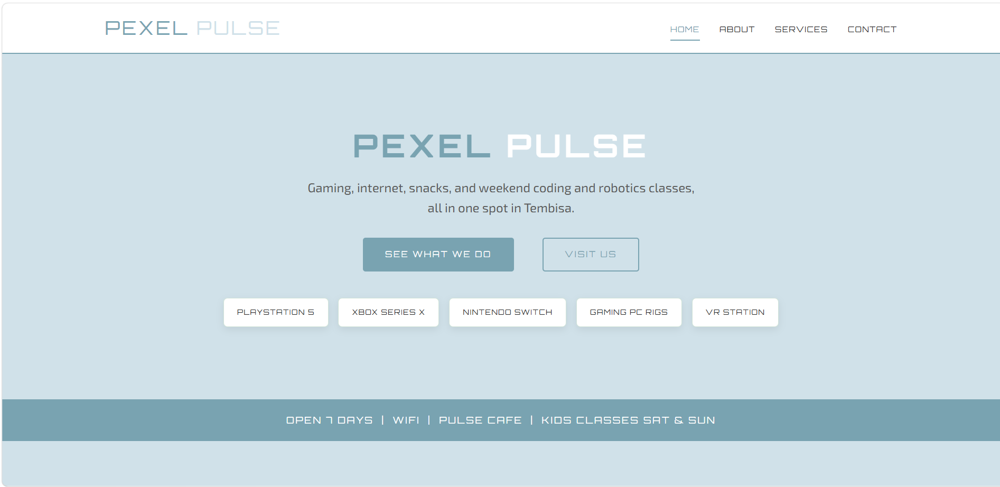
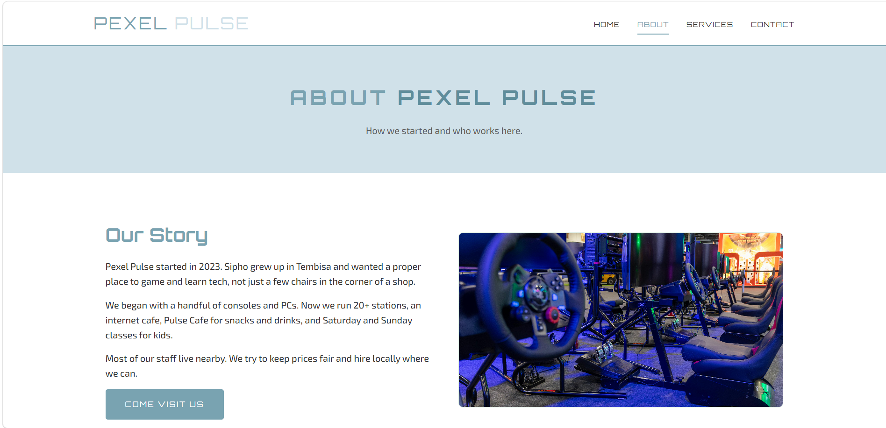

# Pexel Pulse

A multi-page website for **Pexel Pulse**, a gaming studio in Tembisa offering console and PC gaming, an internet cafe, Pulse Cafe, and weekend coding and robotics classes for kids.

Built as a school project using **HTML5** and **CSS3** only.

---

## Live preview

Open `index.html` in any modern browser (Chrome, Edge, Firefox). No build step or server required.

---

## Screenshots

### Home page



### About page



### Footer


---

## Tech stack

| Technology | Use |
|------------|-----|
| HTML5 | Page structure, navigation, forms, tables |
| CSS3 | Layout, colours, responsive design |
| Font Awesome 4.7 | Icons on the contact page (CDN) |

---

## Project structure

```
Gaming studio/
├── index.html          # Home
├── about.html          # About us
├── services.html       # Services and pricing
├── contact.html        # Contact form and FAQs
├── css/
│   └── styles.css      # Shared stylesheet
├── images/
│   ├── home.png        # README screenshot (home)
│   ├── about.png       # README screenshot (about)
│   ├── Footer.png      # README screenshot (footer)
│   ├── gaming1.jpg     # About page (site content)
│   ├── gaming2.jpg     # Gaming studio (services)
│   └── cafe.jpg        # Pulse Cafe (services)
└── README.md
```

---

## Pages

| Page | Description |
|------|-------------|
| **Home** | Hero, services overview, why choose us |
| **About** | Our story, stats, values, team |
| **Services** | Gaming, internet cafe, Pulse Cafe, kids classes, price guide |
| **Contact** | Contact details, enquiry form, opening hours, FAQs |

---

## Design notes

- One external stylesheet (`css/styles.css`) linked on every page
- CSS variables for brand colours
- Flexbox for navigation, cards, footer, and service layouts
- Media queries for smaller screens
- Three images only (per project requirements)

---

## Contact (demo details)

- **Location:** 123 Rabie Street, Tembisa, Gauteng  
- **Phone:** 011 000 1234  
- **Email:** info@pexelpulse.co.za  
- **Hours:** Mon–Sun, 09:00–22:00 (see contact page for full schedule)

---

## Author

Melsoft school project — Portia Mashaba 

